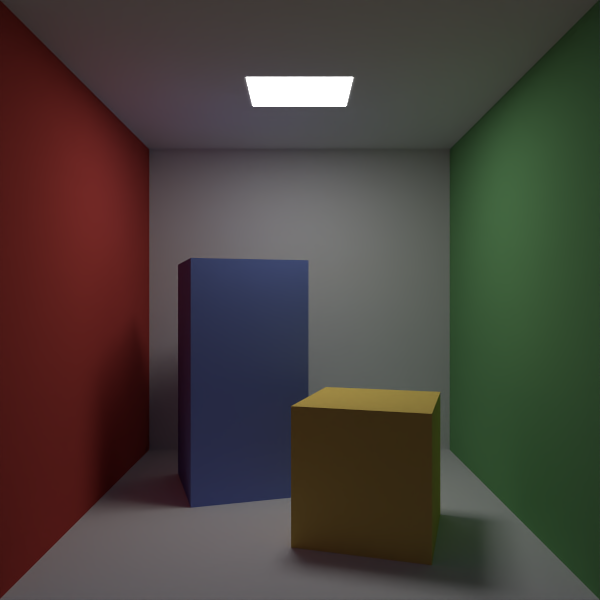
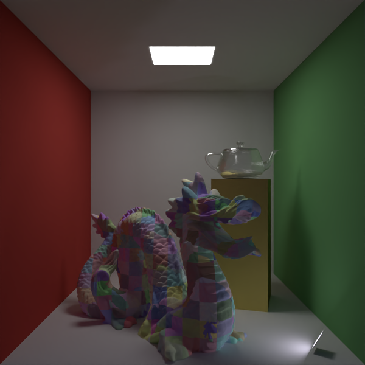
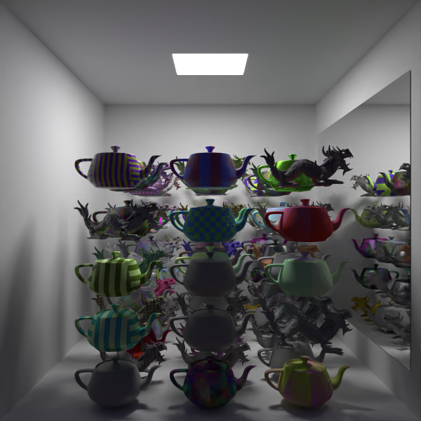
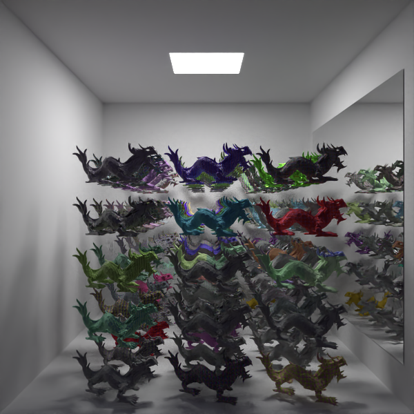
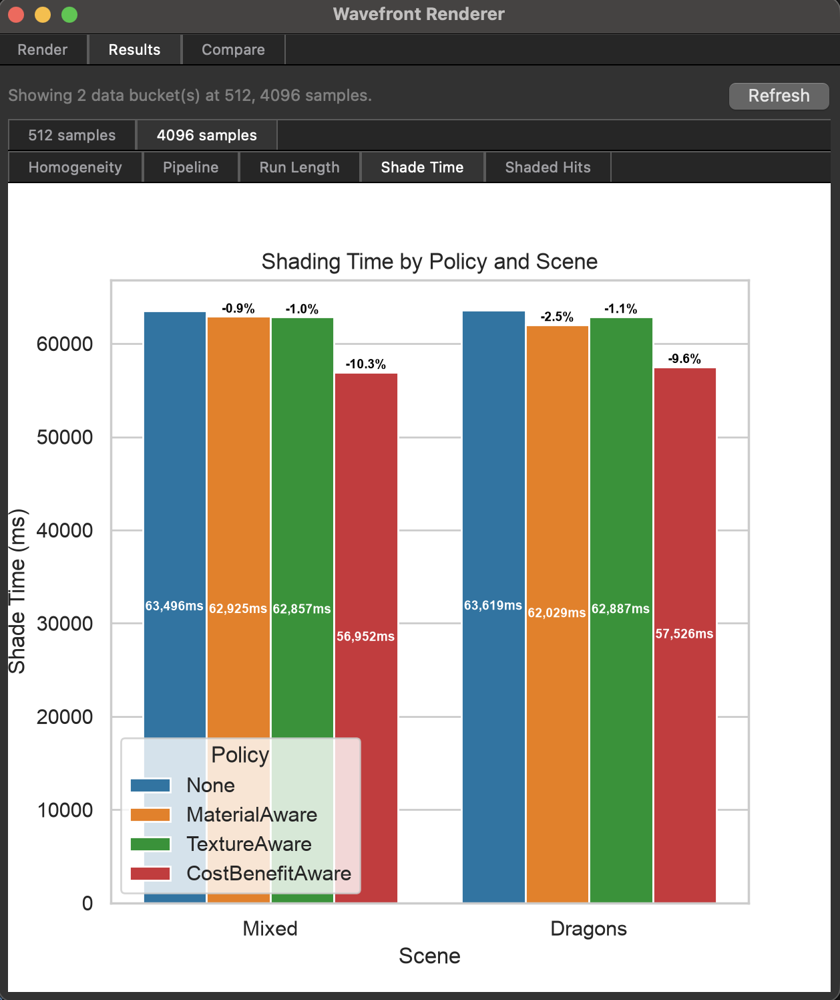
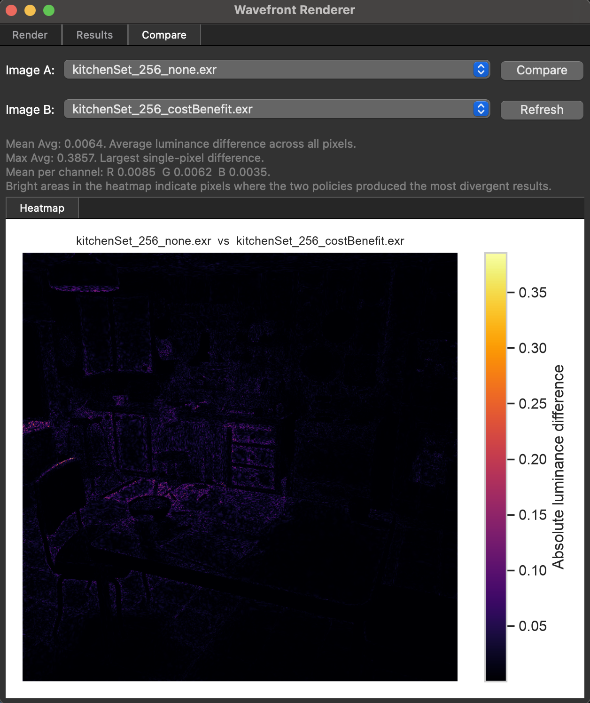

# Wavefront Path Tracer


A CPU wavefront path tracer built as part of the MSc thesis _"Adaptive Wavefront Scheduling for Coherent CPU Path Tracing"_ (NCCA, Bournemouth University, 2026). The project investigates whether reordering rays by material or texture ID before shading improves CPU cache utilisation and reduces render time.

<p align="center">
  <br>
  <em>Cornell box dragon, 256spp</em>
</p>

### Table of Contents

- [Stack](#stack)
- [The Research Question](#the-research-question)
- [Implementation](#implementation)
- [Scenes](#scenes)
- [Benchmarks](#benchmarks)
- [Findings](#findings)

### Stack

|                    | Version                                   |
| ------------------ | ----------------------------------------- |
| C++                | 17                                        |
| Python             | 3.12+                                     |
| Build              | CMake 3.20+, Ninja                        |
| BVH / intersection | Intel Embree 4                            |
| Parallelism        | Intel oneTBB (bundled with USD)           |
| Scene format       | OpenUSD 26.5                              |
| Image I/O          | OpenImageIO 2.5                           |
| Denoising          | Intel Open Image Denoise 2                |
| GUI                | PySide6 6.7+                              |
| Plotting           | matplotlib 3.11, seaborn 0.13, pandas 3.0 |
| Testing            | GoogleTest                                |

_For scene setup, GUI usage and benchmark pipeline details see [USERGUIDE.md](./USERGUIDE.md)_

### The Research Question

In a wavefront path tracer, rays at the same bounce depth are processed in bulk. In the naive case, rays arrive in arbitrary order, consecutive shading operations touch different materials, textures and shader branches, causing cache thrashing. The hypothesis: **sorting rays by material or texture ID before shading should improve cache line homogeneity and reduce total shading time.**

Four scheduling policies were implemented and benchmarked:

| Policy        | Description                                                                               |
| ------------- | ----------------------------------------------------------------------------------------- |
| `none`        | No sorting. Default arrival order, used as baseline                                       |
| `material`    | Sort by material ID using TBB parallel sort                                               |
| `texture`     | Sort by texture ID targeting texture cache coherence                                      |
| `costBenefit` | Sort by material ID, then apply Morton code spatial sub-sort weighted by EMA shading cost |

### Implementation

#### 1. Wavefront Pipeline

The renderer processes rays in a **Structure of Arrays (SoA)** layout for cache friendly access. Each bounce iterates:

```
Generate camera rays (RayQueue)
  → Embree BVH traversal (parallel, per-ray)
    → Populate ShadingQueue (hit point, normal, material ID, texture ID, throughput)
      → [Optional] Sort ShadingQueue by scheduling policy
        → Shade all hits and scatter new rays into next RayQueue
          → Repeat until max depth or Russian Roulette termination
```

#### 2. Embree BVH Integration

Scene geometry is handed off to Intel Embree 4 via a custom wrapper that handles triangle soup construction, multi-mesh scene registration and ray packet traversal. All intersection queries run through Embree's BVH, with hit results barycentric coordinates, triangle index and geometry ID. Mapped back to the renderer's `HitRecord` for material and texture lookup.

#### 3. OpenUSD Scene Loading

Scenes are described in `.usda` files and loaded via a full OpenUSD pipeline. The loader resolves mesh geometry, world transforms, material bindings, UV primvars, texture assets, camera parameters and emissive light sources. Supported primitives include meshes, spheres, cylinders and cubes. Material properties as diffuse colour, roughness, metallic, IOR and custom renderer extensions are parsed from shader inputs. HDRI environment maps are importance-sampled using a 2D luminance distribution built at load time.

#### 4. Multiple Importance Sampling and Next Event Estimation

At each bounce, direct lighting is estimated via **Next Event Estimation (NEE)**. A shadow ray is casted explicitly toward a sampled light source, bypassing the need for a path to randomly hit it. The direct contribution is then combined with the BSDF-sampled contribution using **Multiple Importance Sampling (MIS)** and the power heuristic, weighting each strategy by its PDF to minimise variance. This significantly reduces noise on scenes with small or bright area lights without requiring additional path samples.

#### 5. Scheduling Policies (`ShadingQueue`)

All policies produce a `sortedIndices` array that the shading loop iterates. No data is moved, only the traversal order changes.

- **None**: rays shaded in arrival order, used as baseline.
- **MaterialAware**: `tbb::parallel_sort` by material ID. Consecutive shading calls hit the same shader branch and material parameters, keeping them warm in cache.
- **TextureAware**: sort by texture ID, targeting texture sampler cache coherence.
- **CostBenefitAware**: sort by material ID first, then apply a **Morton code spatial sub-sort** within each material group to preserve BVH locality for the next bounce. Sort weight is modulated by a per-material EMA shading cost.

#### 6. Adaptive Sampling (`AdaptiveSampler`)

Per-pixel luminance convergence is tracked using **Welford's online algorithm**, a numerically stable single-pass method for running mean and variance. A pixel stops receiving samples when its standard error of the mean drops below 5% of the running mean. This concentrates work on noisy regions without a second pass.

#### 7. Cost-Aware Russian Roulette (`CostTracker`)

An **Exponential Moving Average** (α = 0.05) tracks shading time per material ID in nanoseconds. Russian Roulette termination probability is scaled by `relativeCost(materialID)`: the ratio of this material's average cost to the global average. Expensive materials are terminated earlier, reducing average shading cost per bounce.

#### 8. Benchmark Pipeline

A full research toolchain automates data collection and visualisation. The renderer writes structured statistics to stdout after each run. `parse_results.py` extracts metrics via regex into per-sample-count CSVs. `plot_results.py` produces figures using pandas and seaborn: shade time comparisons, pipeline breakdowns, run length distributions and cache homogeneity charts. All figures are surfaced in a PySide6 GUI with per-sample-bucket tabs and a luminance-difference heatmap compare view.

### Scenes

| Cornell Box                                                   | Cornell Box Dragon                                                   |
| ------------------------------------------------------------- | -------------------------------------------------------------------- |
|        |  |
| **Stress Test Mixed**                                         | **Stress Test Dragons**                                              |
|  |     |

**Cornell Box**: Classic rendering reference scene used to validate physically-based light transport. Features diffuse colors and OpenUSD scene loading. Used to verify correctness of the BVH, materials and path tracing implementation.

**Cornell Box Dragon**: Cornell box variant featuring a Stanford dragon with a spatial checker texture and a glass teapot on a metallic pedestal. Demonstrates mixed material handling with diffuse, glass, metallic and procedural texture shading within a single scene.

**Stress Test Mixed**: A grid of ~90 objects mixing teapots and dragons, each assigned one of 30+ procedurally generated materials spanning diffuse, plastic, metal and glass types with texture maps ranging from 256px to 4096px. The high material and texture diversity makes this the most demanding benchmark scene for measuring scheduling coherence gains.

**Stress Test Dragons**: A dense grid of xyzrgb dragons totalling ~17.9M triangles, each assigned varied materials. The extreme geometric complexity makes this the heaviest benchmark scene, stress-testing BVH traversal performance and exposing how scheduling policies behave under high triangle counts.

### Benchmarks

| Result Graphs                                                           | Heatmap Comparison                                                |
| ----------------------------------------------------------------------- | ----------------------------------------------------------------- |
|  |  |

### Findings

Benchmarks ran at three sample tiers (256 at 600×600, 1024 at 720×720, 4096 at 1080×1080) across both stress scenes with 3 runs per policy. Shade times were averaged across runs.

- **CostBenefit** was the only policy to outperform the `none` baseline consistently across all sample counts and both scenes, delivering between **7% and 10% shade time reduction**. The result held at every resolution from 256 samples at 600×600 up to 4096 samples at 1080×1080. Confirming that the benefit scales with wavefront size rather than being an artefact of a specific configuration. The key insight behind CostBenefit is that it solves two problems at once, rays hitting the same material are shaded together, keeping shader code and material data warm in cache, while the spatial sub-sort ensures that the next batch of rays fired from those hit points originate from nearby locations in the scene. This means both the shading step and the subsequent traversal step benefit from locality, compounding the gain across every bounce in the path.

- **MaterialAware** and **TextureAware** both increased shade time by 1–7% over baseline on both scenes. Sorting by a single key reorganises rays enough to pay the cost of the sort, but not enough to recover that cost through faster shading. Grouping rays by material makes shading more coherent, but the rays then fired from those hit points are spatially scattered, the next traversal step becomes less efficient. The sort solves one problem while creating another, resulting in a net loss.

The pattern is consistent across all three sample tiers, indicating that scheduling benefit is structural rather than noise-dependent. The full data and per-policy figures are available in the Results tab of the GUI.

> **Full benchmark results and graphs available in [RESULTS.md](./RESULTS.md)**

---

_Status: development completed, thesis submitted August 2026._
