# Results

This file presents the benchmark results comparing the four scheduling policies (None, Material, Texture, and Cost-Benefit) across the Mixed and Dragon scenes at four sample counts and resolutions.

## Shade Time

### 256 Samples (600x600)

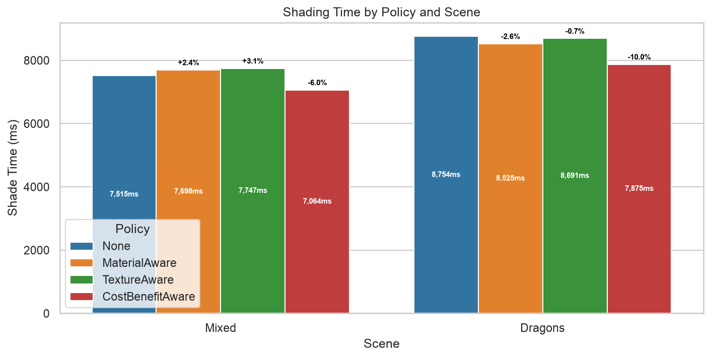

### 1024 Samples (720x720)

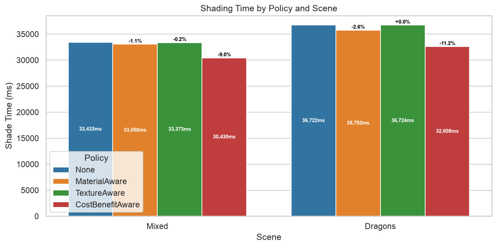

### 2048 Samples (840x840)

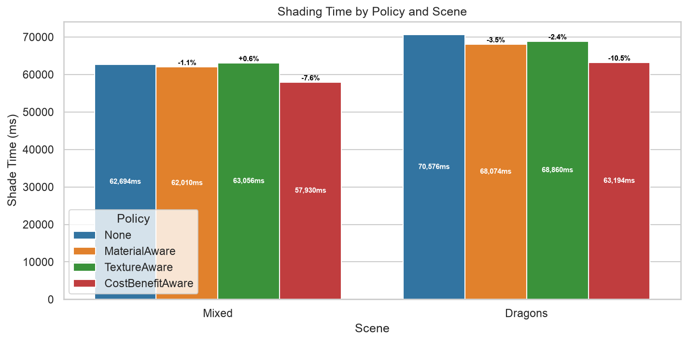

### 4096 Samples (1080x1080)

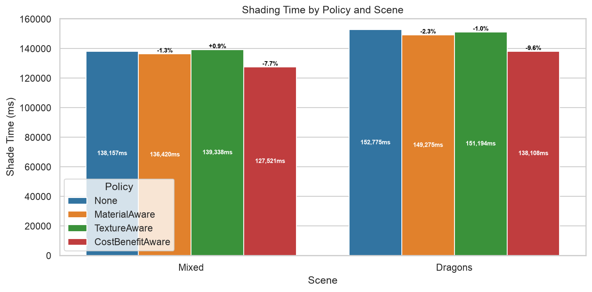

## Pipeline Time Breakdown

### 256 Samples (600x600)

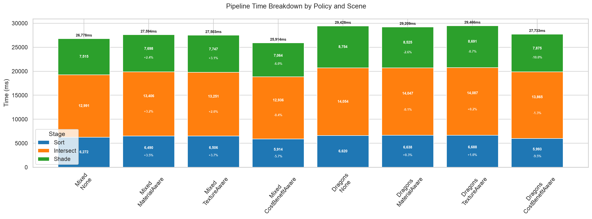

### 1024 Samples (720x720)

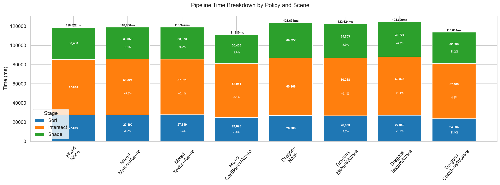

### 2048 Samples (840x840)

### 4096 Samples (1080x1080)

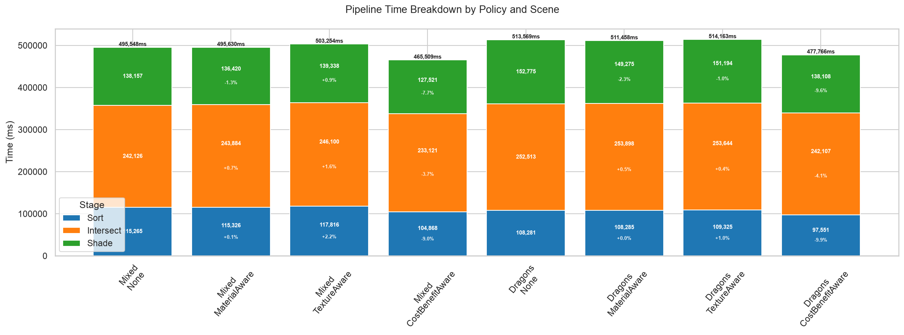

## Execution Coherence

### 256 Samples (600x600)

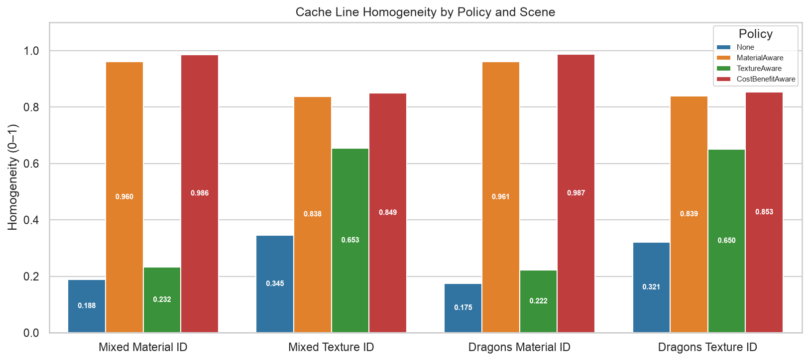

### 1024 Samples (720x720)

### 2048 Samples (840x840)

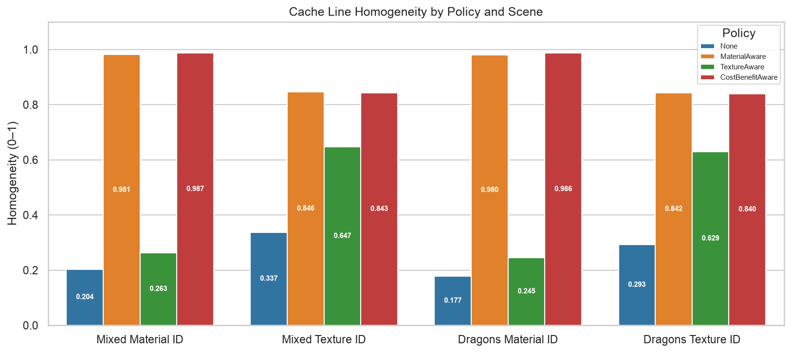

### 4096 Samples (1080x1080)

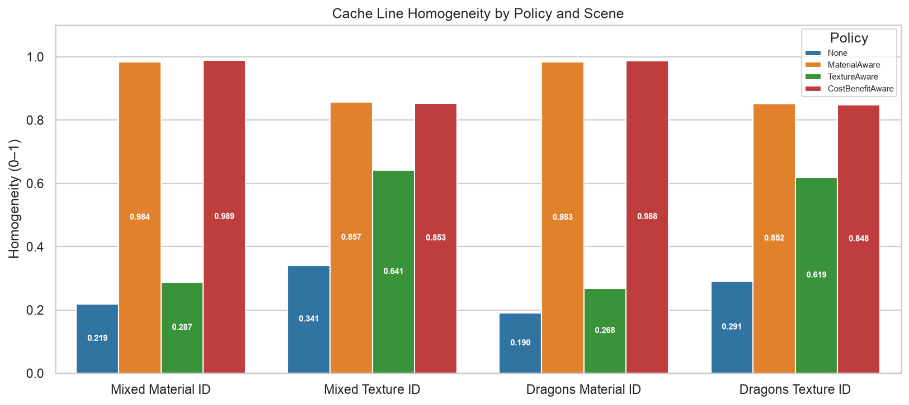

## Run Length

### 256 Samples (600x600)

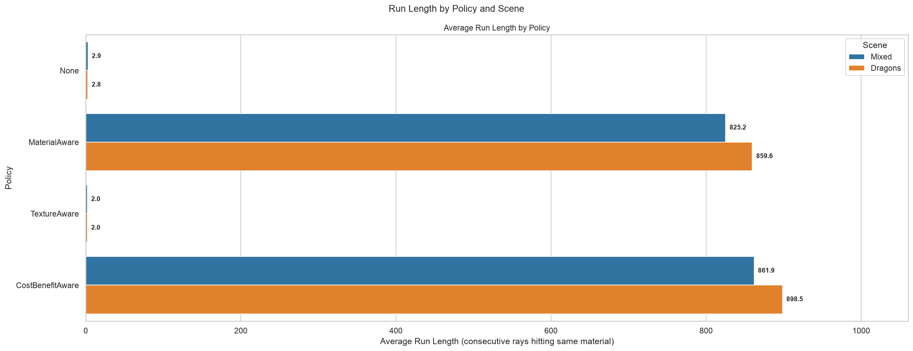

### 1024 Samples (720x720)

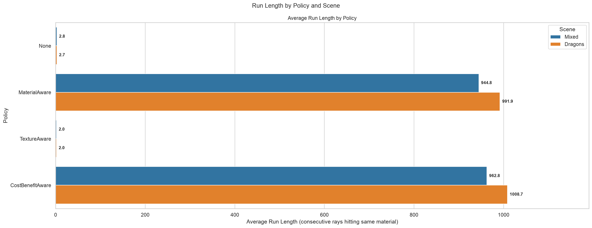

### 2048 Samples (840x840)

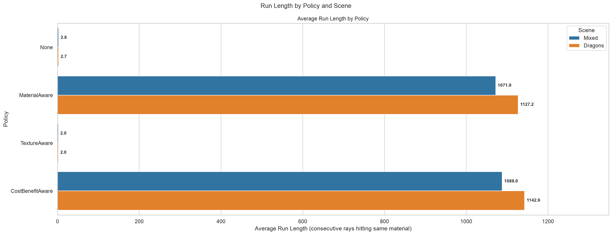

### 4096 Samples (1080x1080)

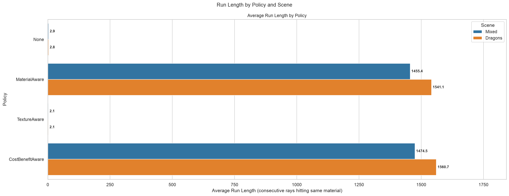

## Shaded Hits

### 256 Samples (600x600)

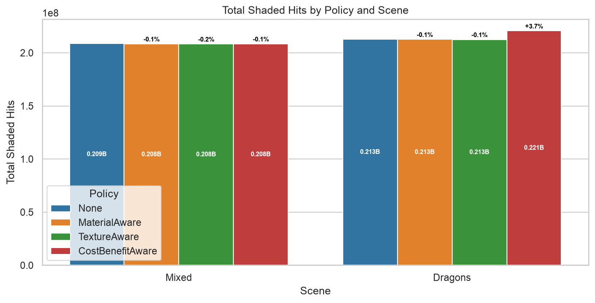

### 1024 Samples (720x720)

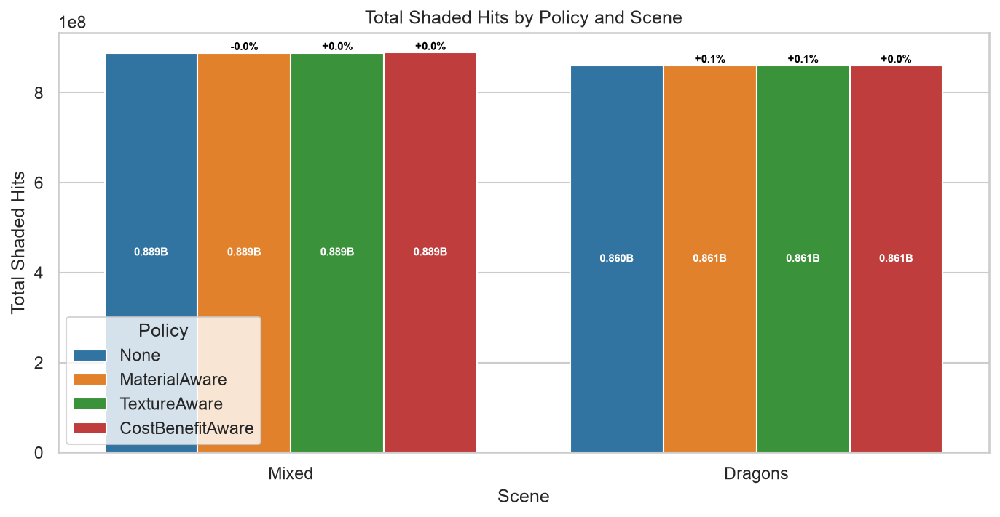

### 2048 Samples (840x840)

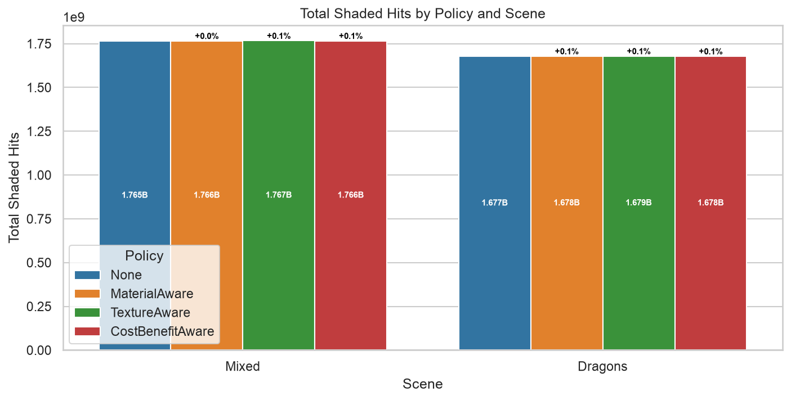

### 4096 Samples (1080x1080)

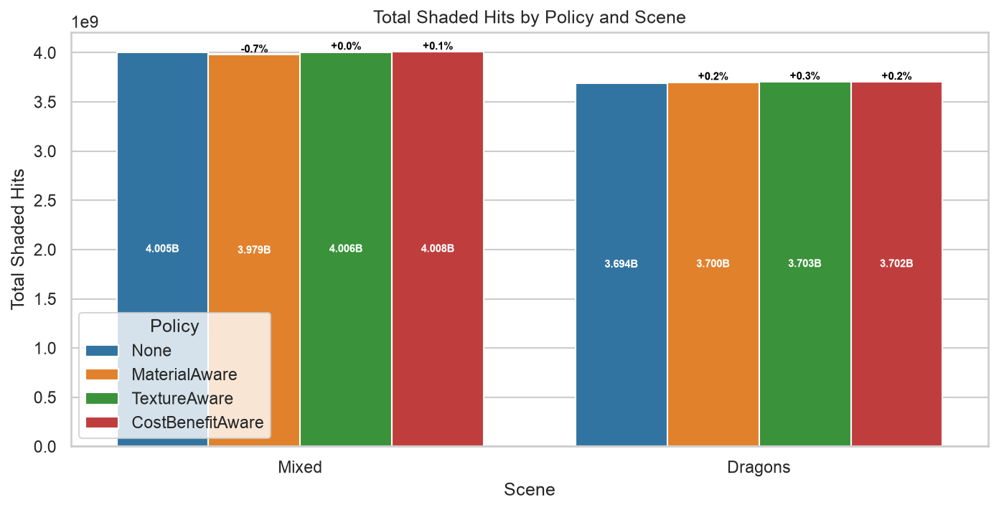
